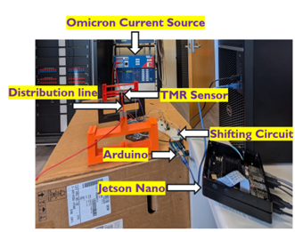

# Phasor Current Estimation from Saturated TMR Signals Using Deep Learning

This project demonstrates an edge-AI system for accurate phasor current estimation in power systems using Tunnel Magneto-Resistance (TMR) sensors—capable of handling sensor saturation and non-linearity through a hybrid hardware/software approach. It integrates real-time data acquisition using Arduino & Jetson Nano, and applies a CNN-LSTM deep learning model for robust phasor prediction.

---




---

## Table of Contents

- [Overview](#overview)
- [Hardware and Experimental Setup](#hardware-and-experimental-setup)
- [Software Workflow](#software-workflow)
- [How to Run](#how-to-run)
- [Results](#results)
- [Applications](#applications)
- [Further Reading](#further-reading)
- [License](#license)

---

## Overview

- **Goal:** Accurately estimate phasor currents in power systems from TMR sensors—even when the sensor saturates at high currents.
- **Motivation:** TMR sensors are affordable and compact for grid sensing but saturate under fault conditions. Classic methods fail; deep learning repairs the signal.
- **Solution:** An LSTM-based model predicts phasor currents using real TMR, power, and temperature sensor data.

---

## Hardware and Experimental Setup

**Components:**
- **Omicron Current Source:** Injects accurate reference currents for validation.
- **Distribution Line:** Conveys current.
- **TMR Sensor:** Magnetically senses the current.
- **Shifting Circuit:** Circuits (LM741, voltage divider) convert raw TMR output for Arduino ADC.
- **Arduino Uno:** Reads analog signals (TMR, power, temperature), streams over serial.
- **Jetson Nano:** Receives data, logs CSV, and trains LSTM/CNN models in real-time.

**Setup:**
- Connect TMR sensor to shifting circuit.
- Inputs (Bmag: A1, Power: A2, Temp: A3) to Arduino analog pins.
- Set serial baud for Arduino↔Jetson Nano to 38400.
- See figures for setup and measurement schematic.

---

## Software Workflow

1. **Arduino (C++):**
    - Reads analog channels, streams comma-separated data as serial (bmag, pow1, temp).

2. **Jetson Nano Data Logger (Python):**
    - Opens serial port, batches 100 samples, appends them to `data.csv`.
    - Timestamps each sample.

3. **Model Training & Prediction:**
    - Monitors data row count.
    - On sufficient data (`t_train`, e.g., 100), normalizes, reshapes, and fits a CNN-LSTM model (`Keras`, `Tensorflow`).
    - Outputs MSE, RMSE, MAE; plots true vs predicted phasor values.
    - Training and inference automated by Python `schedule`.

---

## How to Run

1. **Hardware Preparation:**
    - Connect TMR sensors & power circuit as per schematic.
    - Upload Arduino code (from repo) to board.
    - Connect Arduino to Jetson Nano via USB.

2. **Jetson Nano Setup:**
    - Install packages:
      ```
      sudo apt-get install python3-pip
      pip3 install pyserial pandas keras tensorflow matplotlib scikit-learn schedule
      ```

3. **Clone the Project:**
    ```
    git clone https://github.com/hemanthpuppala/Phasor-Current-estimation.git
    cd Phasor-Current-estimation
    ```

4. **Start Data Logger:**
    ```
    python3 <logger_script>.py
    
    ```

5. **View Plots and Model Summaries:**
    - Training, evaluation, and plots will auto-display.
    - True & predicted current curves, errors, and performance metrics shown.

---

## Results

- **Model accuracy:** LSTM model achieves <2% validation error on phasor current even during saturation (see actual vs predicted plot).
- **Robustness:** Handles both linear and saturated sensor regimes.
- **Real-time performance:** Fully deployed on Jetson Nano for fast feedback.
- **Comparison:** Outperforms classic curve fitting and lookup-table methods under saturation.

---

## Applications

- Real-time power grid phasor monitoring
- Fault detection and event analysis
- Any time-series sensor signal "repair" under nonlinearity or saturation
- Can be adapted for other edge AI platforms or sensors

---

## Further Reading

- **Full technical paper:** [Phasor Current Measurement from Saturated TMR Signals Using LSTM Model](./phasor_current_paper.pdf)
- **TMR Sensor Principle:** [Open Access Reference](https://iopscience.iop.org/article/10.1088/1742-6596/2530/1/012017)
- **Omicron CMS 356 Info:** [Omicron Energy — CMS 356](https://www.omicronenergy.com/en/products/cms-356/)
- **Keras LSTM Documentation:** [Keras LSTM](https://keras.io/api/layers/recurrent_layers/lstm/)

---

## License

This project is distributed for academic and research purposes. Contributions welcome via pull requests or issues.

---

*For further details, see the [PDF paper](phasor_current_paper.pdf) included in this repo or contact maintainers via GitHub.*

